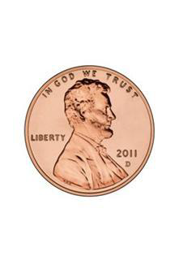
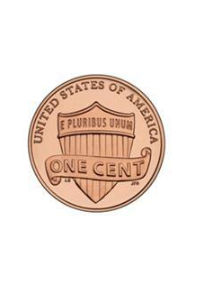

# Heads-and-tails-js
Create a heads or tails game that will be played by a real person and a computer.

The game should go for 5 rounds and the winner will be determined by who guessed the most rights on the 5 rounds.

example:

__round 1:__

computer guessed tails and you guessed heads

outcome: heads

you get a 1 and computer gets a 0 (zero)

__round 2:__

computer guessed tails and you guessed heads

outcome: heads

you get a 2 and computer gets a 0 (zero)

__round 3:__

computer guessed heads and you guessed heads

outcome: heads

you get a 3 and computer gets a 1

__round 4:__

computer guessed tails and you guessed heads

outcome: tails

you get a 3 and computer gets a 2

__round 5:__

computer guessed tails and you guessed heads

outcome: heads

you get a 4 and computer gets a 2

__You become a winner in this set because you guessed the most correct predictions__

__All assignments should be hosted on github pages and links submitted to google classroom__

This is the coin side that will be used. They can be found in the __images__ folder

Happy Coding :)
